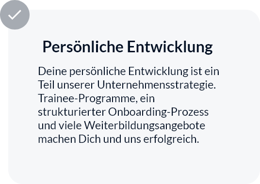

# Cards


Type 1



```markup
<div class="container">
  <div class="row">
    <div class="col-md-4">
      <div class="card-t1">
        <span class="num">7</span>
        <h4>
          <a href="#">IT-Consulting und Beratung bei SAP-Projekten</a>
        </h4>
        <a href="#">
          <span class="arrow"
            ><ion-icon name="arrow-forward-outline"></ion-icon
          ></span>
        </a>
      </div>
    </div>
  </div>
</div>
```


Type 2



```markup
<div class="container">
  <div class="row">
    <div class="col-md-4">
      <div class="card-t2">
        <div class="img">
          <div class="overlay"></div>
          
        </div>
        <div class="content">
          <span class="categories">
            <a href="#">Business</a>
            <a href="#">Insights</a>
          </span>
          <div class="title">
            <a href="#"
              >Automatisiertes Software Testing: Nach COVID-19 wichtiger
              denn je</a
            >
          </div>
        </div>
      </div>
    </div>
  </div>
</div>
```


Type 3




```markup
<div class="container">
  <div class="row">
    <div class="col-md-4">
      <div class="card-t3">
        <div class="content">
          <h4>Persönliche Entwicklung</h4>
          <p>
            Deine persönliche Entwicklung ist ein Teil unserer
            Unternehmensstrategie. Trainee-Programme, ein strukturierter
            Onboarding-Prozess und viele Weiterbildungsangebote machen Dich
            und uns erfolgreich.
          </p>
        </div>
        <div class="icon">
          <ion-icon name="checkmark-outline"></ion-icon>
        </div>
      </div>
    </div>
  </div>
</div>
```


Type 4



```markup
<div class="container">
  <div class="row">
    <div class="col-md-4">
      <div class="card-t4">
        <a href="#">
          <div class="img">
            
            <div class="content">
              <h4>Commerzbank</h4>
              <p>Technology</p>
            </div>
          </div>
        </a>
      </div>
    </div>
  </div>
</div>
```


Type 5



```markup

```

