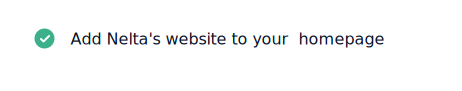
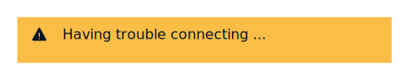
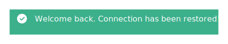

# Flag

## Default

The default flag type. All flags require a `title` and an `icon`.



```markup
<div class="flag">
    <ion-icon name="checkmark-circle"></ion-icon><span>Add Nelta's website to your  homepage</span>
</div>
```

## Appearance

### Information

Information messages alert the user to additional information without requiring an action. Inform the user about something that might help or impact them. Then, let them get back to work. Info messages are also used for loading states.


```markup
<div class="flag-info">
    <ion-icon name="information-circle"></ion-icon><span>We will perform a server upgrade soon!</span>
</div>
```

### Warning

Warning messages appear before we request the user to take action. This is usually in anticipation of a significant change. Have empathy for the user. Inform, but don't alarm. If the warning comes before an action, clearly communicate what will happen if they proceed, and provide an alternative where possible.



```markup
<div class="flag-warning">
    <ion-icon name="warning"></ion-icon><span>Having trouble connecting ...</span>
</div>
```

### Error

Error messages let the user know that something has gone wrong after they've tried to do something or if there are connectivity issues. Explain the problem and provide the user with a next step or an alternative. Keep the message simple and direct, and avoid confusing the user with technical details. If it's our fault, own up to it.


```markup
<div class="flag-error">
    <ion-icon name="alert-circle"></ion-icon><span>The internet may be out to lunch</span>
</div>
```

### Success

Success messages let people know they have completed an action. For these messages, it's best to confirm the outcome and let people continue. If they have just created something, give them an option to view it.



```markup
<div class="flag-success">
    <ion-icon name="checkmark-circle"></ion-icon><span>Welcome back. Connection has been restored!</span>
</div>
```

