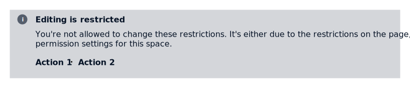

# Section Message

## Appearance

By default, all section message comes with an icon and an area for content. A `title` and `actions` can also be added.

### Info

Info section messages are the default style used to signify a change in state or important information.



```markup
<div class="sm-info">
  <div class="header">
    <ion-icon name="information-circle"></ion-icon>
    <p class="title">Editing is restricted</p>
  </div>
  <div class="content">
    <p>
      You're not allowed to change these restrictions. It's either due to the
      restrictions on the page, or permission settings for this space.
    </p>
    <div class="actions">
      <a href="#">Action 1</a>
      <a href="#">Action 2</a>
    </div>
  </div>
</div>
```

### Warning 

Warning section messages are the most common. They help users: 

* avoid errors
* manage authentication issues 
* take the actions needed to avoid potentially dangerous actions
* feel certain they're making the decision, for example, in confirmation modals.


```markup
<div class="sm-warning">
  <div class="header">
    <ion-icon name="warning"></ion-icon>
    <p class="title">Cannot connect to the database</p>
  </div>
  <div class="content">
    <p>We are unable to save any progress at this time.</p>
  </div>
</div>
```

### Error

Error section messages let the user know when:

* something destructive or critical has happened
* access has been denied
* there are connectivity issues.

They are not a common use case for section messages.


```markup
<div class="sm-error">
  <div class="header">
    <ion-icon name="alert-circle"></ion-icon>
    <p class="title">Connection lost</p>
  </div>
  <div class="content">
    <p>You lost the connection with internet. Please try again!</p>
  </div>
</div>
```

### Confirmation

Confirmation section messages let the user know that an action or event has happened successfully. They are not a common use case for section messages.


```markup
<div class="sm-success">
  <div class="header">
    <ion-icon name="checkmark-circle"></ion-icon>
    <p class="title">You email has been sent successfully!</p>
</div>
```

