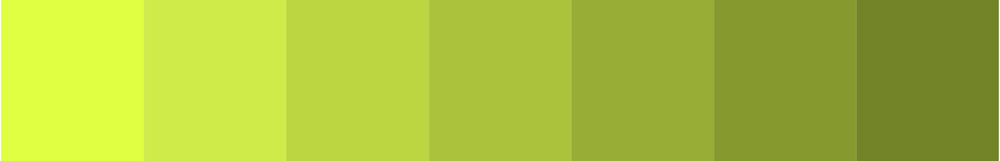

# Color Palette

## Secondary Colors

### Blue Palette

| $blue-1 | $blue-2 | $blue-3 | $blue-4 | $blue-5 | $blue-6 | $blue-7 |
| :--- | :--- | :--- | :--- | :--- | :--- | :--- |
| \#1C2445 | \#2A3564 | \#374683 | \#4557A2 | \#5268C1 | \#6079E0 | \#6D8AFF |

### Yellow Palette

| $yellow-1 | $yellow-2 | $yellow-3 | $yellow-4 | $yellow-5 | $yellow-6 | $yellow-7 |
| :--- | :--- | :--- | :--- | :--- | :--- | :--- |
| \#E0FF43 | \#CEEB3F | \#BCD63A | \#AAC236 | \#97AD31 | \#85992D | \#738428 |

### Neutral Palette

| $neutral-1 | $neutral-2 | $neutral-3 | $neutral-4 | $neutral-5 | $neutral-6 | $neutral-7 |
| :--- | :--- | :--- | :--- | :--- | :--- | :--- |
| \#051225 | \#2D3848 | \#555E6C | \#7E858F | \#A6ABB2 | \#CED1D6 | \#F6F7F9 |

## Gradients

### Blue - Linear

Left to Right

| $blue-1 | $blue-4 |
| :--- | :--- |
| \#1C2445 | \#4557A2 |

### Yellow - Linear

Left to Right

| $yellow-1 | $yellow-4 |
| :--- | :--- |
| \#E0FF43 | \#AAC236 |

## Color pairings

Each background color is paired with a foreground color. The foreground is considered text and ensures that any color chosen is accessible. However, there may be cases where the background color is used for the text color. In such cases it's the responsibility of the designer to meet WCAG 2.1 AA requirements.

### White foreground

| N | Foreground Color | Background Color | Result |
| :--- | :--- | :--- | :--- |
| 1 | \#ffffff | \#11173D | Pass - 17.30 - Super |
| 2 | \#ffffff | \#1C2445 | Pass - 15.13 - Super |
| 3 | \#ffffff | \#262C4E | Pass - 13.52 - Super |
| 4 | \#ffffff | \#3C4160 | Pass - 9.92 - Very good |
| 5 | \#ffffff | \#E0FF4F | Fail - 1.13 - Very poor |
| 6 | \#ffffff | \#D0ED49 | Fail - 1.32 - Very poor |
| 7 | \#ffffff | \#DADADA | Fail - 1.40 - Very poor |
| 8 | \#ffffff | \#EAEAEA | Fail - 1.20 - Very poor |
| 9 | \#ffffff | \#F2F2F2 | Fail - 1.12 - Very poor |

### Main color foreground

| N | Foreground Color | Background Color | Result |
| :--- | :--- | :--- | :--- |
| 1 | \#11173D | \#1C2445 | Fail - 1.14 - Very poor |
| 2 | \#11173D | \#262C4E | Fail - 1.28 - Very poor |
| 3 | \#11173D | \#3C4160 | Fail - 1.74 - Very poor |
| 4 | \#11173D | \#E0FF4F | Pass - 15.31 - Super |
| 5 | \#11173D | \#D0ED49 | Pass - 13.09 - Super |
| 6 | \#11173D | \#DADADA | Pass - 12.38 - Super |
| 7 | \#11173D | \#EAEAEA | Pass - 14.38 - Super |
| 8 | \#11173D | \#F2F2F2 | Pass - 15.45 - Super |
| 9 | \#11173D | \#FFFFFF | Pass - 17.30 - Super |

### Contrast color foreground

| N | Foreground Color | Background Color | Result |
| :--- | :--- | :--- | :--- |
| 1 | \#E0FF4F | \#11173D | Pass - 15.31 - Super |
| 2 | \#E0FF4F | \#1C2445 | Pass - 13.39 - Super |
| 3 | \#E0FF4F | \#262C4E | Pass - 11.97 - Super |
| 4 | \#E0FF4F | \#3C4160 | Pass - 8.78 - Very good |
| 5 | \#E0FF4F | \#D0ED49 | Fail - 1.17 - Very poor |
| 6 | \#E0FF4F | \#DADADA | Fail - 1.24 - Very poor |
| 7 | \#E0FF4F | \#EAEAEA | Fail - 1.06 - Very poor |
| 8 | \#E0FF4F | \#F2F2F2 | Fail - 1.01 - Very poor |
| 9 | \#E0FF4F | \#FFFFFF | Fail - 1.13 - Very poor |

## Color gradient palettes

### Main color

|  |  |  |  |  |  |  |
| :--- | :--- | :--- | :--- | :--- | :--- | :--- |
| \#11173D | \#393E5D | \#60647E | \#888B9E | \#B0B2BE | \#D7D8DF | \#FFFFFF |

### Contrast color

|  |  |  |  |  |  |  |
| :--- | :--- | :--- | :--- | :--- | :--- | :--- |
| \#E0FF4F | \#E5FF6C | \#EAFF8A | \#F0FFA7 | \#F5FFC4 | \#FAFFE2 | \#FFFFFF |

