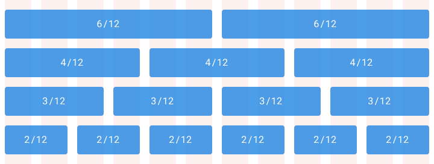
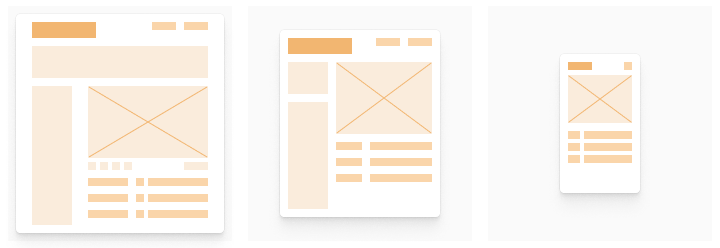

# Grid


We will be using Bootstrap’s grid system for layout and responsiveness.


Please check the link below for more information: [**Grid system - Boostrap v4.5**](https://getbootstrap.com/docs/4.5/layout/grid/)

## How it works

Bootstrap’s grid system uses a series of containers, rows, and columns to layout and align content. It’s built with [flexbox](https://developer.mozilla.org/en-US/docs/Web/CSS/CSS_Flexible_Box_Layout/Basic_Concepts_of_Flexbox) and is fully responsive. Below is an example and an in-depth look at how the grid comes together.

```markup
<div class="container">
  <div class="row">
    <div class="col-sm">
      One of three columns
    </div>
    <div class="col-sm">
      One of three columns
    </div>
    <div class="col-sm">
      One of three columns
    </div>
  </div>
</div>
```

## Grid system - Boostrap

> Use our powerful mobile-first flexbox grid to build layouts of all shapes and sizes thanks to a twelve column system, five default responsive tiers, Sass variables and mixins, and dozens of predefined classes.

## Column grid

A column grid helps you organize content into evenly spaced vertical columns. The space between columns is referred to as the gutter size. Applying your spatial system rules to the gutters will help drive home a consistent rhythm in your designs. A common example is the 12 column grid because it allows you to divide the given area into half, thirds, fourths, sixths.



## Composing a layout

Layouts are the culmination of defined spatial rules and the organization of content into one single composition. Bringing together your content into thoughtful structures is the easy part, making it all flow together with a clear hierarchy across a sea of changing platforms and screen sizes is the hard part.

Defining the scaling logic is now a requirement for both native and web apps. From desktop to mobile and everything in between, the screen sizes and scales can vary widely. There are three main concepts for crafting a layout that can scale gracefully. Some designs will call for all three of these concepts at once.

## Adaptive

An adaptive layout is one that changes entirely based on the format it is presented in. For example, loading different experiences based on desktop, tablet, and mobile devices. This promotes a more tailored experience for the user’s device but can become expensive to rebuild the same functionality into multiple formats.



## Responsive

A responsive layout is fluid and can adapt to a changing format size. This is a common practice on the web and has become a necessity for native apps as screen size variations have increased. This allows you to build a feature one time and expect it to work across all screen sizes. The downside is that touch and mouse interactions are very different and it’s expensive to account for all devices and use cases.


