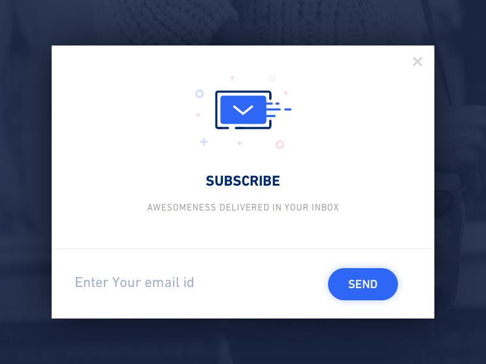

# Benefits modal

The benefits modal component is made up of the following elements:

1. **Illustation:** Should be composed of metaphorical imagery that relates to the content or benefit \(see best practices below\).
2. **Title:** A primary heading \(h1\). The title provides a concise overview of the contents of the journey.
3. **Message:** The contents of the dialog. See content guidelines below.
4. **Actions:** Contains a maximum of two centered buttons. A primary action and some sort of dismiss button. The main action should be self-describing action verbs \('Get started' instead of 'OK'\).
5. **Blanket:** Covers the content underneath the modal, so that the focus is on the modal, and the content beneath is not accidentally selected.

## Best practices

* All first impressions should complement rather than compete with each other. Walk through the entire end-to-end journey that your new experience is a part of. This can help highlight where you may be repetitive or where steps may not be needed. Less is more.
* Try not to overwhelm users with too much information at once. Focus on the top two to three benefits and then gradually introduce changes over time.
* Offer a dismiss option at each point in the journey.

## Illustrations

Illustrations:

* make complex ideas more accessible
* should be displayed as a spot hero image that is metaphorical and designed in conjunction with UI copy
* are used to efficiently convey brand personality
* are a tool to guide people in the right direction or let them know what to expect

## Content guidelines

### Titles

* Use the title to communicate the main benefit in an active and personalized way, for example:
  * "Get news first", instead of "Subscribe"
* Titles are a good place to add wink.
* Try to personalize where you can, for example:
  * "Awesomeness delivered in your inbox", instead of "Subscribe to our newsletter"
* Try to limit titles to three words, although four words are permissible if you are using a short article like “an”, “a”, or “the”.

### Message copy

* Try to keep message length to less than three lines at the product's minimum supported size.
* Don't just point out what the feature or functionality is. Tell people why it's important at this point in time.
* Be considerate of people's time and patience. Be short and to the point, and avoid using company jargon.

### Accessibility

* Include copy to supplement illustrations.
* Use alt text for illustrations.

