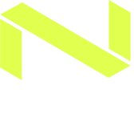
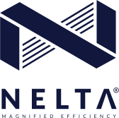

# Logo

## Vertical Logo Showcase

| Vertical 1 | Vertical 2 | Vertical 3 |
| :--- | :--- | :--- |
|   |   |    |







| Vertical 4 | Vertical 5 | Vertical 6 |
| :--- | :--- | :--- |
|   |   |    |







| Vertical 7 | Vertical 8 | Vertical 9 |
| :--- | :--- | :--- |
|   |    |    |







| Vertical 10 | Vertical 11 |  |
| :--- | :--- | :--- |
|   |    |  |





## Horizontal Logo Showcase

```text
plain: true
span: 2
dark: true
src: "/assets/logo/horizontal-1.svg"
title: "Horizontal 1"
```

```text
plain: true
span: 2
light: true
src: "/assets/logo/horizontal-2.svg"
title: "Horizontal 2"
```

```text
plain: true
span: 2
light: true
src: "/assets/logo/horizontal-3.svg"
title: "Horizontal 3"
```

```text
plain: true
span: 2
light: true
src: "/assets/logo/horizontal-4.svg"
title: "Horizontal 4"
```

```text
plain: true
span: 2
dark: true
src: "/assets/logo/horizontal-5.svg"
title: "Horizontal 5"
```

```text
plain: true
span: 2
light: true
src: "/assets/logo/horizontal-6.svg"
title: "Horizontal 6"
```

```text
plain: true
span: 2
dark: true
src: "/assets/logo/horizontal-7.svg"
title: "Horizontal 7"
```

```text
plain: true
span: 2
dark: true
src: "/assets/logo/horizontal-8.svg"
title: "Horizontal 8"
```

```text
plain: true
span: 2
light: true
src: "/assets/logo/horizontal-9.svg"
title: "Horizontal 9"
```

```text
plain: true
span: 2
light: true
src: "/assets/logo/horizontal-10.svg"
title: "Horizontal 10"
```

```text
plain: true
span: 2
light: true
src: "/assets/logo/horizontal-11.svg"
title: "Horizontal 11"
```

```text
plain: true
span: 2
dark: true
src: "/assets/logo/horizontal-12.svg"
title: "Horizontal 12"
```

```text
plain: true
span: 2
dark: true
src: "/assets/logo/horizontal-13.svg"
title: "Horizontal 13"
```

```text
plain: true
span: 2
dark: true
src: "/assets/logo/horizontal-14.svg"
title: "Horizontal 14"
```

```text
plain: true
span: 2
light: true
src: "/assets/logo/horizontal-15.svg"
title: "Horizontal 15"
```

```text
plain: true
span: 2
light: true
src: "/assets/logo/horizontal-16.svg"
title: "Horizontal 16"
```

```text
plain: true
span: 2
light: true
src: "/assets/logo/horizontal-17.svg"
title: "Horizontal 17"
```

```text
plain: true
span: 2
light: true
src: "/assets/logo/horizontal-18.svg"
title: "Horizontal 18"
```

```text
plain: true
span: 2
light: true
src: "/assets/logo/horizontal-19.svg"
title: "Horizontal 19"
```

```text
plain: true
span: 2
light: true
src: "/assets/logo/horizontal-20.svg"
title: "Horizontal 20"
```

```text
plain: true
span: 2
light: true
src: "/assets/logo/horizontal-21.svg"
title: "Horizontal 21"
```

## Horizontal Logo Download

```text
title: Horizontal 1 (.svg)
subtitle: 3 KB
span: 2
url: "/assets/logo/horizontal-1.svg"
```

```text
title: Horizontal 2 (.svg)
subtitle: 3 KB
span: 2
url: "/assets/logo/horizontal-2.svg"
```

```text
title: Horizontal 3 (.svg)
subtitle: 3 KB
span: 2
url: "/assets/logo/horizontal-3.svg"
```

```text
title: Horizontal 4 (.svg)
subtitle: 3 KB
span: 2
url: "/assets/logo/horizontal-4.svg"
```

```text
title: Horizontal 5 (.svg)
subtitle: 3 KB
span: 2
url: "/assets/logo/horizontal-5.svg"
```

```text
title: Horizontal 6 (.svg)
subtitle: 3 KB
span: 2
url: "/assets/logo/horizontal-6.svg"
```

```text
title: Horizontal 7 (.svg)
subtitle: 3 KB
span: 2
url: "/assets/logo/horizontal-7.svg"
```

```text
title: Horizontal 8 (.svg)
subtitle: 3 KB
span: 2
url: "/assets/logo/horizontal-8.svg"
```

```text
title: Horizontal 9 (.svg)
subtitle: 3 KB
span: 2
url: "/assets/logo/horizontal-9.svg"
```

```text
title: Horizontal 10 (.svg)
subtitle: 3 KB
span: 2
url: "/assets/logo/horizontal-10.svg"
```

```text
title: Horizontal 11 (.svg)
subtitle: 3 KB
span: 2
url: "/assets/logo/horizontal-11.svg"
```

```text
title: Horizontal 12 (.svg)
subtitle: 3 KB
span: 2
url: "/assets/logo/horizontal-12.svg"
```

```text
title: Horizontal 13 (.svg)
subtitle: 3 KB
span: 2
url: "/assets/logo/horizontal-13.svg"
```

```text
title: Horizontal 14 (.svg)
subtitle: 3 KB
span: 2
url: "/assets/logo/horizontal-14.svg"
```

```text
title: Horizontal 15 (.svg)
subtitle: 3 KB
span: 2
url: "/assets/logo/horizontal-15.svg"
```

```text
title: Horizontal 16 (.svg)
subtitle: 3 KB
span: 2
url: "/assets/logo/horizontal-16.svg"
```

```text
title: Horizontal 17 (.svg)
subtitle: 3 KB
span: 2
url: "/assets/logo/horizontal-17.svg"
```

```text
title: Horizontal 18 (.svg)
subtitle: 3 KB
span: 2
url: "/assets/logo/horizontal-18.svg"
```

```text
title: Horizontal 19 (.svg)
subtitle: 3 KB
span: 2
url: "/assets/logo/horizontal-19.svg"
```

```text
title: Horizontal 20 (.svg)
subtitle: 3 KB
span: 2
url: "/assets/logo/horizontal-20.svg"
```

```text
title: Horizontal 21 (.svg)
subtitle: 3 KB
span: 2
url: "/assets/logo/horizontal-21.svg"
```

